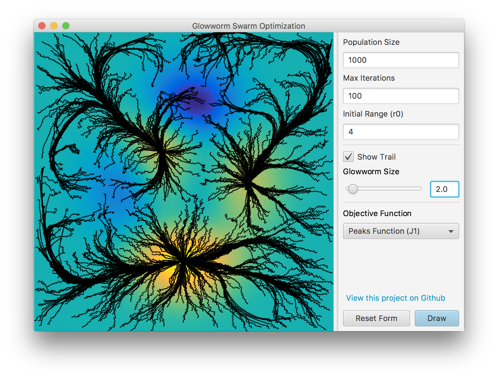

# Glowworm Swarm Optimization Java

A Java implementation and visualization of the glowworm swarm optimization (GSO) algorithm invented by K.N. Krishnanand and Debasish Ghose for the capturing of multiple optima of multimodal functions.



This app was created as part of a seminar work and served as an aid to understand the glowworm swarm optimization. It is a simple visualization of the glowworm movement with the target function in the background. You can choose between several target functions from the paper:

- Peaks
- Rastrigin
- Circles
- Staircase
- Plateaus
- Sky Blue
- Equal Peaks

The parameters *population size*, *iterations*, and *the initial neighborhood range* can be set in the graphical interface. Further parameters, e.g. *the initial luciferin level*, *rho* or *gamma* can easily be adjusted in the program code. 

## Preview GIF


## Credits

- This Program contains code from [CircleSkinner](https://github.com/tinevez/CircleSkinner/blob/master/src/main/java/net/imagej/circleskinner/util/ColorMap.java) made by [Jean-Yves Tinevez](https://github.com/tinevez).
- The GSO Algorithm was invented by K.N. Krishnanand and Debasish Ghose.

## Known Bugs

1. The new calculated position of the glowworms from the iteration *t* should be applied at iteration *t+1* and not at the same iteration (see GSOAlgorithm.java, Lines 127 and 128).

## License

This project is open source licensed under the BSD 3-Clause License. Please see the [LICENSE file](LICENSE.md) for more information. 

If you use this app or the code in a presentation or lecture you could credit me like this:

```
Pascal Wagler (2017). "Glowworm Swarm Optimization Java" (https://github.com/Wandmalfarbe/Glowworm-Swarm-Optimization-Java)
```